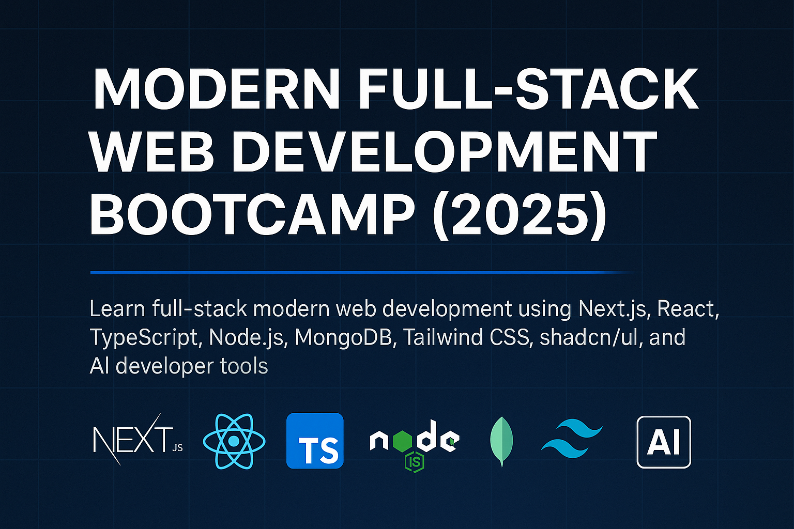

# Modern Full-Stack Web Development Bootcamp (2025)

A fully modern web development bootcamp website built with **Next.js 14**, **TypeScript**, **Tailwind CSS**, and **shadcn/ui**.  
This website showcases the full course curriculum, instructor details, and an interactive 13-module syllabus for the 2025 edition of the bootcamp.

## 🚀 Tech Stack
- Next.js 14 (App Router)
- TypeScript
- Tailwind CSS
- shadcn/ui
- Fully responsive modern UI

## 📚 Sections Included
- **Hero Section** – Course intro, CTA buttons  
- **Overview Section** – Duration, difficulty, practical work  
- **What Makes This Bootcamp Unique**  
- **Target Audience**  
- **13-Module Syllabus** (interactive accordion)  
- **Schedule & Duration**  
- **Instructor Section**  
- **FAQ Section**  
- **Footer**

## 🧩 Features
- Clean component-based architecture  
- Modern and minimal SaaS-style design  
- Built with Tailwind + shadcn/ui  
- SEO-ready metadata + OG image  
- Easy to extend (sign-up, pricing, blog, etc.)

## 🌍 Live Demo
(https://web-bootcamp.vercel.app/)
## 👨‍🏫 Instructor
Mahmoud Al Shukri — Full-Stack Developer & Technical Consultant.
